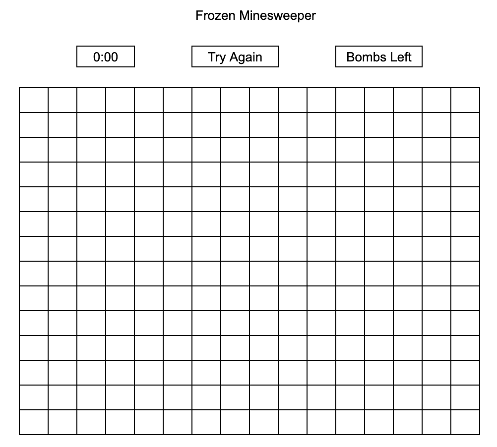

# Frozen Minesweeper

## Introduction:
Before I had access to more intense computer games, Minesweeper was what I'd play when I was bored. I thought it'd be great to replicate this timeless game while adding my own flavor to it. What better way to do so than to make it Frozen themed?! In this version, the bombs are fires set by the evil Prince Hans, and Queen Elsa will send snowflakes to flag the fires. Help Elsa keep Arendelle safe from the terrors of Hans!

## Play the game:
[Play Frozen Minesweeper!](https://skylarw19.github.io/Minesweeper/) 

## View of Game:
Initial wireframe:

Post-styling:

Middle of Game:

## Technology Implemented:
- JavaScript
- CSS
- HTML
- Git 

## Credits:
- Background Image by Walt Disney Animation Studios: https://images-na.ssl-images-amazon.com/images/I/91mwqh22xML._SL1500_.jpg
- Custom Frozito font by JonnaVu: https://www.fontspace.com/frozito-font-f28478
- Snowflake power-up sound by InspectorJ: https://freesound.org/people/InspectorJ/sounds/411460/
- Explosion sound by tommccann: https://freesound.org/people/tommccann/sounds/235968/ 
- confetti-js to generate snowfall by Agezao: https://github.com/Agezao/confetti-js#readme.

## Pseudocode:
- Generate game board
  - randomly generate bomb placement and ensure a bomb is not completely surrounded by other bombs
  - generate numbers on board to show bomb count
- Player can: 
  - Click cell to reveal
    - if bomb is clicked, reveal cell and end game (player loses)
    - if zero is clicked, reveal all connecting zeros until adjacent non-zero numbers are revealed
    - if a non-zero number is clicked, reveal cell
  - Right click cell to flag
    - decrease number of remaining flags
- If all bombs are flagged, player wins
- Player can click button to restart game

# User Experience:
## User Persona #1:
Anna is incredibly bored staying in the castle all day. Luckily, she's discovered Frozen Minesweeper and is able to stay occupied until she's able to step outside of the castle on Elsa's coronation day.   

## User Persona #2:
Sven is tired of constantly being thought of as only a moose who loves carrots. He is looking forward to constantly practicing Minesweeper in order to improve his skills in order to show Kristoff that he's not just another moose.

## Minimum Viable Product:
- As a user, I should be able to click a cell to reveal it
- As a user, I should be able to right click a cell to flag it
- As a user, I should see the number of flags remaining
- As a user, I should see a message if I win or lose the game
- As a user, I should be able to restart the game at any time

## Next Steps:
- ~~Add a timer or stopwatch~~
- ~~Add audio for clicks~~
- ~~Add falling snow in background or falling Olafs~~
- Allow user input for board size
- Allow user input for number of bombs
- Add mobile responsiveness
